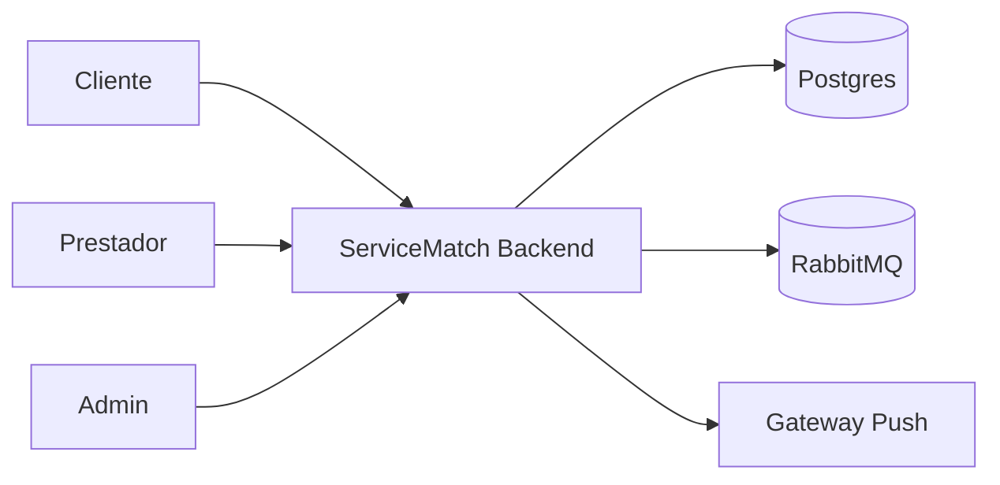
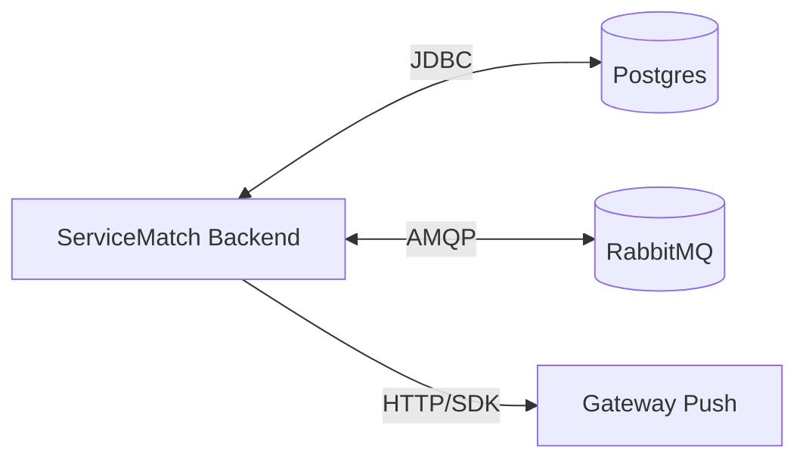
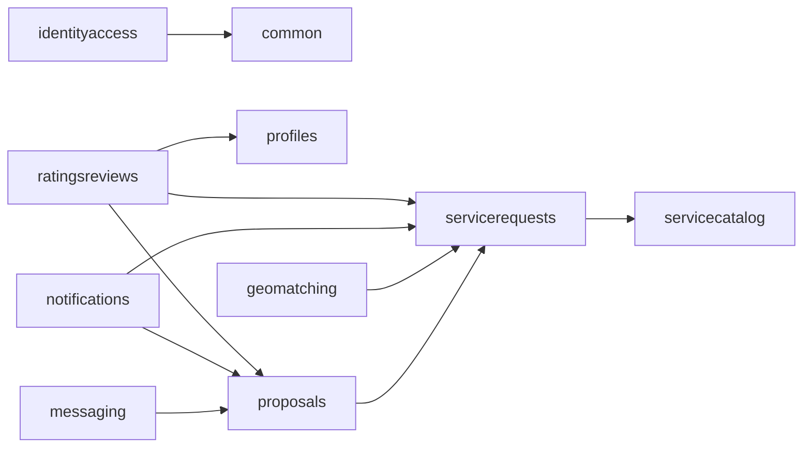
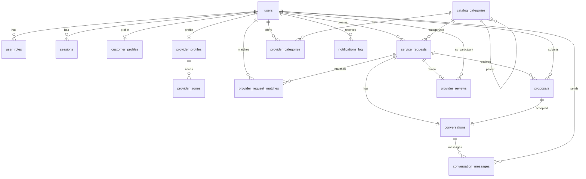
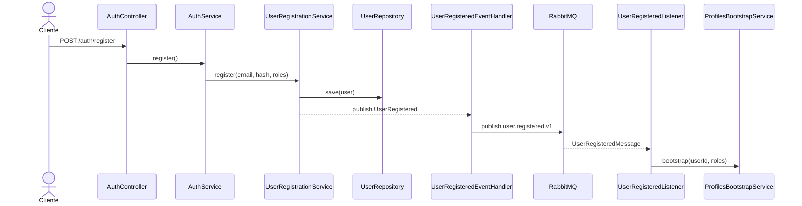
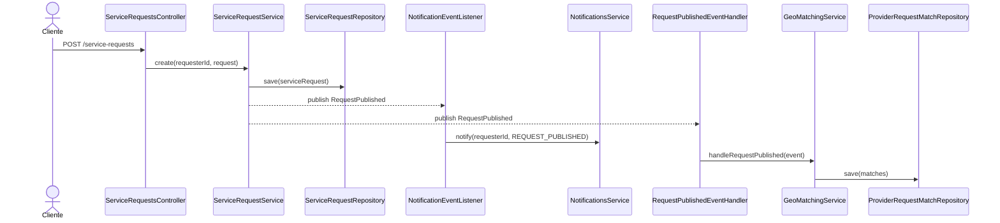
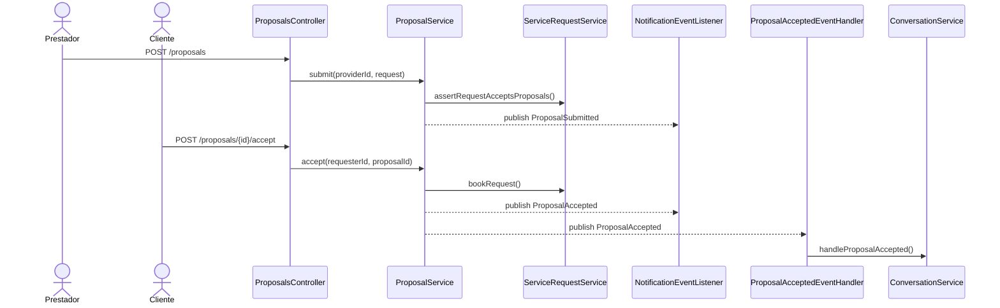
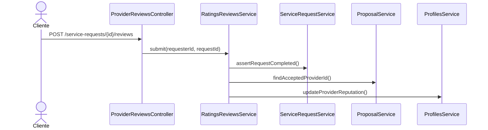

# Documentacao - ServiceMatch Backend

## Visao geral
O ServiceMatch Backend e uma API monolitica modular (Spring Modulith) para um marketplace de servicos. Ele conecta clientes que publicam solicitacoes de servico com prestadores que recebem um feed geolocalizado, enviam propostas, conversam e recebem avaliacao. O sistema usa Postgres para persistencia, RabbitMQ para eventos de integracao e um gateway de notificacoes (stub) para push.

## Principais capacidades
- Autenticacao com JWT e refresh tokens com rotacao.
- Cadastro e gestao de perfis de cliente e prestador.
- Catalogo de categorias de servico (admin).
- Criacao de solicitacoes com geolocalizacao e status.
- Matching por categoria e raio geospacial para gerar feed de prestadores.
- Propostas de prestadores para solicitacoes publicadas.
- Conversas entre cliente e prestador apos aceitacao da proposta.
- Notificacoes de eventos chave e log de entrega.
- Avaliacoes de prestadores e calculo de reputacao.

## Arquitetura geral
- Estilo: monolito modular com DDD e camadas (domain, application, infra).
- Modulos definidos com Spring Modulith e dependencias controladas por `@ApplicationModule`.
- Eventos internos via Spring `ApplicationEventPublisher`.
- Evento de integracao via RabbitMQ (ex: `user.registered.v1`).

### Diagrama de contexto

### Diagrama de containers

## Modulos (Spring Modulith)
- `identityaccess`: autenticacao, usuarios, sessoes e JWT. Depende de `common`.
- `profiles`: perfis de cliente e prestador, zonas de atendimento e reputacao.
- `servicecatalog`: categorias de servico.
- `servicerequests`: solicitacoes de servico e eventos de publicacao. Depende de `servicecatalog::api`.
- `geomatching`: matching de prestadores por categoria e zona. Depende de `servicerequests::events`.
- `proposals`: propostas e aceitacao. Depende de `servicerequests::api`.
- `messaging`: conversas e mensagens. Depende de `proposals::events`.
- `notifications`: notificacoes para eventos de solicitacao e proposta. Depende de `servicerequests::api`, `servicerequests::events`, `proposals::events`.
- `ratingsreviews`: avaliacoes e reputacao. Depende de `servicerequests::api`, `proposals::api`, `profiles::api`.
- `common`: utilitarios e contratos compartilhados (modulo aberto).

### Diagrama de dependencias entre modulos

## Estrutura em camadas
- `domain`: entidades, value objects e eventos de dominio.
- `application`: casos de uso, DTOs e regras de orquestracao.
- `infra`: web (controllers), persistencia (repositories), config e adapters externos.

## Persistencia e modelo de dados
- Banco: Postgres com migrations Flyway em `src/main/resources/db/migration`.
- Tabelas principais: `users`, `sessions`, `service_requests`, `proposals`, `conversations`, `provider_reviews`, `notifications_log`.

### Diagrama ER (simplificado)

## Eventos e mensageria
### Eventos internos (ApplicationEvent)
- `UserRegistered`: publicado no registro de usuario.
- `RequestPublished`: publicado ao criar solicitacao com status `PUBLISHED`.
- `ProposalSubmitted`: publicado ao enviar proposta.
- `ProposalAccepted`: publicado ao aceitar proposta.
- `ProvidersMatched`: publicado apos matching geografico.

### Evento de integracao (RabbitMQ)
- `user.registered.v1`: publicado por `identityaccess` e consumido por `profiles` para bootstrap de perfis.

## Fluxos principais (sequencias)
### Cadastro e bootstrap de perfis

### Publicacao de solicitacao e matching

### Proposta e aceitacao

### Avaliacao e reputacao

## API (alto nivel)
- Publico:
  - `POST /auth/register`, `POST /auth/login`, `POST /auth/refresh`, `POST /auth/logout`
  - `GET /catalog/categories`
- Protegido (JWT + roles):
  - `GET /profiles/me`, `PATCH /profiles/me`
  - `POST /profiles/me/zones`, `PATCH /profiles/me/zones/{zoneId}`, `DELETE /profiles/me/zones/{zoneId}`
  - `POST /service-requests`
  - `GET /provider/feed` ou `GET /matching/feed`
  - `POST /proposals`, `POST /proposals/{proposalId}/accept`
  - `POST /conversations/{conversationId}/messages`, `GET /conversations/{conversationId}/messages`
  - `POST /service-requests/{requestId}/reviews`
  - `GET /rbac/client`, `GET /rbac/provider`, `GET /rbac/admin`

## Seguranca
- JWT com roles no claim `roles` e prefixo `ROLE_`.
- Hash de senha com BCrypt.
- Refresh tokens com hash SHA-256 em `sessions` e rotacao por `SessionService`.
- Endpoints anonimos limitados a `auth`, `actuator` e `swagger`.

## Configuracao e ambientes
- `application.yml` define datasource, RabbitMQ e seguranca.
- Profiles: `dev`, `test`, `prod` com overrides em arquivos dedicados.
- Docker Compose provem Postgres e RabbitMQ (management em `:15672`).

## Observabilidade
- Actuator habilitado: `health` e `info`.
- OpenAPI/Swagger configurado via `OpenApiConfig`.

## Consideracoes de system design
- Consistencia: escrita principal em Postgres; eventos internos usam o mesmo banco e transacao local.
- Eventual consistency: efeitos secundarios (notificacoes, matching) reagem a eventos de dominio.
- Idempotencia: criacao de conversas trata concorrencia com verificacao de existencia e trata violacao de chave unica.
- Escalabilidade: app stateless, pode escalar horizontalmente; Postgres e RabbitMQ sao pontos centrais.
- Melhorias possiveis:
  - Outbox pattern para garantir publicacao de eventos.
  - Retries e DLQ para notificacoes e listeners RabbitMQ.
  - Observabilidade com tracing e metrics detalhadas.

## Pontos de extensao
- Substituir `StubPushGateway` por um provider real (FCM, SNS, etc).
- Enriquecer matching (ranking por reputacao, tempo de resposta, etc).
- Expor endpoints de listagem de solicitacoes, propostas e conversas.
- Expandir politicas de RBAC para escopos mais finos.
